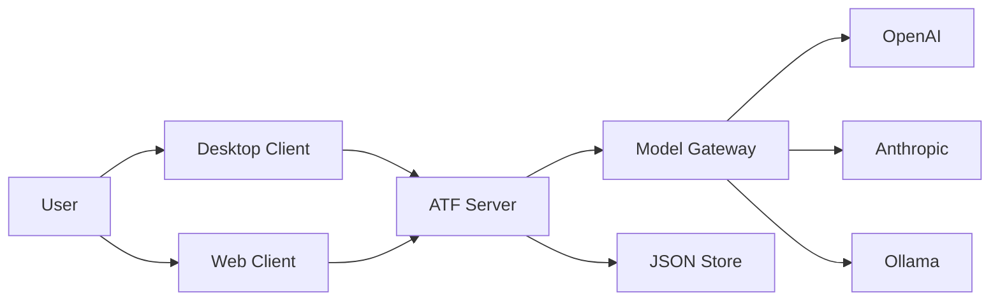

# AI Task Force 系统设计与实现说明

## 1. 文档目的

本文档面向求职展示，目标不是简单介绍“我做了一个 AI 项目”，而是清晰说明以下几点：

- 这个系统解决的真实问题是什么
- 我为什么这样设计，而不是做成一个通用聊天机器人或通用 autonomous agent 平台
- 当前系统的架构边界、核心流程、实现方式、工程取舍分别是什么
- 作为高级工程师，如何评价这个系统的优点、缺点、风险和下一步演进方向

本文档以当前代码实现为准，重点参考以下模块：

- `Clients/Desktop`
- `Clients/Web`
- `Server/src/config.js`
- `Server/src/model-gateway.js`
- `Server/src/orchestrator.js`
- `Server/src/store.js`
- `Server/src/persistence/json-store.js`
- `Server/src/schema.js`

---

## 2. 项目定位

### 2.1 一句话定义

AI Task Force 是一个“结构化 AI 团队工作台”，而不是一个泛化聊天应用，也不是一个无限自治的 agent 平台。

### 2.2 要解决的问题

我认为当前很多 AI 产品的问题不在于模型本身不够强，而在于执行过程不透明：

- 用户把复杂任务交给模型后，不知道任务被如何拆解
- 不知道当前是谁在处理
- 不知道为什么失败
- 不知道是否是模型路由错误、上下文不充分、评审标准不稳定，还是前端只是没有显示出来
- 一旦进入“重试”，系统往往只是重复调用大模型，而不是做受控的失败恢复

因此，这个项目的核心目标不是“让 AI 看起来更聪明”，而是：

> 把概率性的模型调用，放进一个可检查、可追踪、可恢复的执行壳层里。

### 2.3 产品边界

这个项目有意避免了两个方向：

- 不优先做通用 autonomous agent society
- 不优先做任意工作流编排平台

相反，我选择先把一个固定流程做扎实：

```text
User -> Leader -> Planner -> Writer -> Reviewer -> Leader Final Response
```

这样的边界选择有三个原因：

- MVP 更容易验证价值
- 任务状态、角色职责、数据结构可以先稳定下来
- 对求职作品来说，更能展示“产品抽象能力 + 工程落地能力”，而不是堆砌概念

---

## 3. 开发理念

### 3.1 Bounded Execution 优先于 General Intelligence

系统不是追求“像人一样自由”，而是追求“在约束内可靠执行”。

体现为：

- 角色固定
- 流程固定
- 状态有限
- 重试有上限
- 评审有结构化协议

### 3.2 Inspectability 优先于 Magic

很多 AI 应用追求“看起来一键完成”，但实际问题一旦出现，用户和开发者都无法定位。

本项目优先暴露：

- 当前任务状态
- 当前责任角色
- 每个子任务输出
- 每次模型调用的 provider / model / duration / timeout / textChars
- 审核结论与失败原因

这使它更像一个 execution workspace，而不是一个黑箱聊天框。

### 3.3 Heterogeneous Routing 是一等公民

系统从设计上就承认：

- 不同角色适合不同模型
- 不是所有步骤都必须走最贵的远程模型
- 模型路由本身应该可见、可配、可调试

因此，架构里单独抽象了 `model-gateway`，支持：

- OpenAI
- Anthropic
- Ollama

当前默认路由是：

- Leader -> OpenAI GPT
- Planner -> OpenAI GPT
- Writer -> Ollama Qwen
- Reviewer -> OpenAI GPT

这体现的是工程判断，而不是模型崇拜：

- 高判断、低容错的步骤走远程强模型
- 高频生成、成本敏感的步骤走本地模型

### 3.4 壳层优先于页面

Desktop 客户端不是普通 dashboard，也不是单页聊天窗口。

我把它设计成接近 Slack / VS Code 的壳层应用：

- 左侧 outer rail 负责工作区切换
- 中间 sidebar 负责资源树和上下文切换
- 右侧 stage 负责具体内容展示

这样做是因为产品本质不是“问答”，而是“协作工作台”。

### 3.5 轻技术栈是刻意设计，不是能力不足

当前实现没有优先引入 React、Nest、数据库 ORM、消息队列、WebSocket 框架，原因不是不会，而是当前阶段更重视：

- 尽快验证领域模型是否成立
- 让架构决策先为业务问题服务
- 控制复杂度，避免基础设施先行导致方向模糊

因此当前的技术栈是：

- Desktop: Electron + Vanilla JS
- Web: 静态 HTML/CSS/JS
- Server: Node.js 原生 `http` 模块
- Persistence: JSON snapshot store

对于 MVP 和求职作品，这种选择反而能体现清晰的取舍能力。

---

## 4. 开发过程

### 4.1 第一阶段：先把共享产品模型做出来

项目一开始不是先做“更好看的界面”，而是先确定共享语言：

- Agent
- Task
- Subtask
- TaskEvent
- ConversationMessage

这是后续 Web、Desktop、Server 能对齐的前提。

### 4.2 第二阶段：桌面壳层原型

在产品感知层面，我优先做 Desktop 原型，因为这个产品更像“工作台”而不是“网页表单”。

这一阶段验证了几个关键假设：

- Team 必须默认进入 Overview，而不是直接进入单个 agent
- 产品不能退化成一个 centered dashboard
- Chat、Team、Task、Projects、Usage、Settings 必须是并列 workspace

### 4.3 第三阶段：后端编排与模型路由

确认 UI 壳层可用后，我把重点转向执行核心：

- 模型配置加载
- provider adapter
- per-role route
- 固定多角色工作流
- 任务 API
- 直接 agent chat API

这是项目从“原型界面”变成“真实运行系统”的分水岭。

### 4.4 第四阶段：持久化、可观察性、失败恢复

如果没有持久化和失败恢复，系统只能算 demo。

因此当前实现补齐了：

- JSON 持久化
- 任务编号
- 归档与删除
- 全任务重试
- 失败步骤重试
- review attempt 限制
- human confirmation 升级路径
- 服务端日志
- 子任务级模型调用元数据

### 4.5 当前阶段的真实状态

当前系统已经不是静态演示，而是一个可运行、可查看、可重试、可持久化的 MVP。

但它也明确还不是最终形态，尚未完成的核心包括：

- 更严格的状态机约束
- 更强的 typed contract
- WebSocket 或 streaming
- 更完整的 Web 客户端后端接入
- 真正的 usage telemetry
- 数据库存储与迁移体系

---

## 5. 总体架构



### 5.1 架构分层

系统可以分成四层：

1. 交互层
   Desktop 和 Web，负责工作区、聊天、任务详情、模型路由选择

2. 应用层
   Server，负责 API、任务编排、任务状态推进、重试与恢复

3. 模型接入层
   model-gateway + provider adapter，负责多 provider 路由与统一调用

4. 存储层
   JSON Store，负责当前单机持久化

### 5.2 为什么是这种形态

这样分层的意义在于：

- 前端不直接依赖具体 provider
- 编排逻辑不与 UI 混在一起
- 模型接入层可以替换而不影响任务状态模型
- 存储层可以从 JSON 平滑升级到 DB

---

## 6. 核心领域模型

### 6.1 Agent

Agent 不是自由自治体，而是 workflow role。

当前固定角色：

- Leader
- Planner
- Writer
- Reviewer

每个 Agent 具备：

- `id`
- `name`
- `role`
- `description`
- 当前路由 provider / model
- 当前状态
- 当前处理任务

### 6.2 Task

Task 是整个执行流程的主实体，包含：

- 任务 ID
- 任务编号 `number`
- 标题
- 用户输入
- 当前状态
- 当前负责人
- 最终输出
- 错误信息
- 归档时间
- 创建 / 更新时间

### 6.3 Subtask

Subtask 是每个阶段的执行单元，例如：

- `plan`
- `draft`
- `revise`
- `review`
- `summary`

它记录：

- 归属任务
- 分配角色
- 输入文本
- 输出文本
- 结构化 writer submission
- 结构化 review decision
- 模型调用信息
- 当前状态
- 顺序号

### 6.4 TaskEvent

TaskEvent 是任务状态推进和系统动作的审计线索，例如：

- `task_created`
- `planning_started`
- `planning_completed`
- `writing_started`
- `review_passed`
- `task_failed`
- `human_confirmation_required`

### 6.5 ConversationMessage

消息分两类：

- 用户消息
- agent 生命周期消息

系统特意保留 message 维度，是因为它和 event 的语义不同：

- `event` 适合机器查看和时间线呈现
- `message` 更适合直接给用户看工作流过程

---

## 7. 任务状态机

当前系统虽然还没有抽成独立状态机引擎，但已经具备明确的状态集合：

- `pending`
- `planning`
- `writing`
- `revising`
- `reviewing`
- `completed`
- `failed`
- `human_confirmation`

其中 terminal 状态在 `Server/src/schema.js` 中定义为：

- `completed`
- `failed`
- `human_confirmation`

### 7.1 状态推进逻辑

典型主流程如下：

```text
pending
-> planning
-> writing
-> reviewing
-> completed
```

如果评审失败：

```text
reviewing
-> revising
-> reviewing
-> completed | human_confirmation
```

如果模型调用异常：

```text
任意运行态
-> failed
```

### 7.2 服务重启后的恢复策略

`schema.js` 里有一个非常务实的恢复策略：

- 持久化恢复时，如果任务不是 terminal 状态
- 直接标记为 `failed`
- 并写入 `Server restarted before this task completed.`

这个策略不完美，但很合理，因为它避免了“重启后系统假装自己还知道执行到了哪里”。

---

## 8. 后端设计

## 8.1 配置层

配置加载由 `Server/src/config.js` 负责，特点是多来源合并：

- 默认配置 `Server/atf.config.js`
- 本地覆盖 `Server/atf.config.local.js`
- 环境变量覆盖
- 本地 key 文件读取

支持的 secret 来源包括：

- `openai.key`
- `anthropic.key`
- `claude.key`

这里体现的是工程上的“本地开发友好性”：

- 不强依赖云配置平台
- 不把 key 硬编码进 repo
- 保持本地可运行

## 8.2 模型网关

`Server/src/model-gateway.js` 是系统最关键的中间层之一。

它负责：

- 维护每个角色当前 route
- 拉取 provider 模型目录
- 合并 configured models 和 live models
- 控制 enabled route 集合
- 对外暴露统一的 `generate` / `generateConversation`

### 8.2.1 统一 route 抽象

route 的核心格式是：

```text
provider::model
```

例如：

- `openai::gpt-5.4-2026-03-05`
- `ollama::qwen3:8b`

这样做的优点：

- UI 可以直接展示和切换
- Server 可以统一解析
- 不需要让前端理解每个 provider 的差异

### 8.2.2 provider 目录与可用性

网关支持三件事：

- provider 是否已配置
- provider 当前是否可用
- 当前有哪些模型可被选择

这使得模型路由不是“配置文件里的暗知识”，而是产品表面的一部分。

## 8.3 Provider Adapter

### 8.3.1 OpenAI Adapter

`Server/src/openai.js`

特点：

- 使用 `/responses` API
- 单次生成和 conversation 分开处理
- 对 conversation 使用 `instructions + transcript` 形式
- 统一把结果归一成 `{ provider, model, text }`

### 8.3.2 Anthropic Adapter

`Server/src/anthropic.js`

特点：

- 调用 `/v1/messages`
- system prompt 单独传入
- 统一解析 `content[].text`

### 8.3.3 Ollama Adapter

`Server/src/ollama.js`

特点：

- 支持 `/api/generate` 和 `/api/chat`
- 使用 `AbortController` 做超时控制
- 当前默认超时为 `180000ms`
- 用较低 temperature 保持输出稳定

这三层适配器体现了一个核心原则：

> 业务层不要知道 provider 的协议差异，业务层只关心角色、输入、输出和失败。

## 8.4 编排器

`Server/src/orchestrator.js` 是当前系统最核心的执行引擎。

### 8.4.1 它负责什么

- 创建任务后启动工作流
- 推进状态
- 创建 subtasks
- 记录 events 和 messages
- 调用各角色模型
- 解析 writer submission
- 解析 reviewer decision
- 做 revision loop
- 做 final synthesis
- 提供失败步骤重试

### 8.4.2 Writer 与 Reviewer 的结构化协议

这是当前实现里我认为最有价值的工程点之一。

Writer 不是返回一段普通文本，而是要求输出 JSON：

```json
{
  "changed": [],
  "unchanged": [],
  "why": "",
  "draft_text": ""
}
```

Reviewer 也不是自由评论，而是要求输出机器可读 JSON：

```json
{
  "result": "pass | fail",
  "attempt": 1,
  "scope": "full | prior_issues_and_changed_regions",
  "rubric": {},
  "blocking_issues": [],
  "minor_issues": [],
  "resolved_issue_ids": [],
  "next_action": "approve | revise | human_confirm",
  "rationale": ""
}
```

这样设计的意义非常大：

- review 不再只是 UI 文案
- review 可以直接驱动 runtime behavior
- revision 可以对准 issue，而不是重新写整篇

### 8.4.3 评审 rubric

当前固定 rubric 为：

- `completeness`
- `correctness`
- `format`
- `consistency`
- `regression`

这比“请你帮我 review 一下”强很多，因为它降低了 reviewer 的漂移空间。

### 8.4.4 重试策略

当前实现有两种重试：

1. 全任务重试
   创建一个新任务，重新走一遍主流程

2. 失败步骤重试
   只针对失败的 subtask，从最近可用状态继续执行

失败步骤重试尤其重要，因为它体现的是“runtime”思路，而不是“重新问一次模型”。

## 8.5 持久化

当前持久化由 `Server/src/store.js` 和 `Server/src/persistence/json-store.js` 共同完成。

### 8.5.1 为什么是 JSON Store

这是一个典型的工程取舍：

- 当前是单用户、本地开发、MVP 阶段
- 任务数据结构还在演化
- 优先需要可读、可恢复、可调试

因此 JSON store 的收益高于数据库。

### 8.5.2 当前持久化内容

持久化 snapshot 包括：

- `nextTaskNumber`
- `tasks`
- `subtasks`
- `events`
- `messages`

### 8.5.3 写入策略

当前写入使用：

- 先写临时文件
- 再 rename 替换正式文件

这是一个简单但有效的原子写策略，避免直接覆盖导致文件损坏。

## 8.6 API 设计

当前 API 足够支撑 Desktop 实际使用：

### 8.6.1 系统与模型接口

- `GET /api/health`
- `GET /api/models`
- `POST /api/models`
- `POST /api/chat`

### 8.6.2 任务接口

- `GET /api/tasks`
- `POST /api/tasks`
- `GET /api/tasks/:taskId`
- `GET /api/tasks/:taskId/events`
- `GET /api/tasks/:taskId/messages`
- `GET /api/tasks/:taskId/snapshot`
- `POST /api/tasks/:taskId/retry`
- `POST /api/tasks/:taskId/retry-step`
- `POST /api/tasks/:taskId/archive`
- `DELETE /api/tasks/:taskId`

### 8.6.3 聚合接口

- `GET /api/agents`
- `GET /api/timeline`

这些接口设计体现了一个原则：

- UI 尽量拿“可直接消费的数据”
- Server 负责聚合和语义整理
- 前端不必自行重建复杂运行态

---

## 9. Desktop 客户端设计

## 9.1 技术形态

Desktop 客户端是：

- Electron 窗口壳
- 单 HTML 页面
- 大量 Vanilla JS 状态与渲染函数

Electron 主进程做得非常克制：

- 创建窗口
- 关闭硬件加速
- 通过 preload 暴露最小 runtime 标识

这符合当前阶段需求：重点在应用壳和工作流体验，而不是原生能力桥接。

## 9.2 Shell 模型

Desktop 的核心设计不是页面，而是 shell：

- outer rail
- collapsible middle sidebar
- right-side stage

这让系统天然支持多个 operational workspace：

- Chat
- Team
- Task
- Projects
- Usage
- Settings

## 9.3 前端状态设计

`Clients/Desktop/app.js` 中维护了较完整的本地状态，包括：

- 当前工作区
- 当前 sidebar entry
- Team Overview 的 list / grid 模式
- 主题
- 语言
- 当前任务摘要
- 任务列表
- 直接聊天会话
- 后端连接与模型目录
- mock 的 Projects / Usage 数据

### 9.3.1 为什么用本地状态对象

因为当前不是组件框架阶段，而是产品交互和模型语义验证阶段。

这种实现的优点是：

- 改动快
- 状态清晰
- 更容易直接对接后端快照

代价是：

- 文件较大
- 模块边界不如框架式组件清晰
- 后续需要拆分

## 9.4 前端与后端的协作方式

Desktop 会优先探测后端：

- 如果后端可用，走真实 API
- 如果后端不可用，退回本地模拟任务生命周期

这种 dual-mode 设计对产品开发很有价值：

- UI 可以先开发
- 无需后端始终在线
- 演示和联调都更灵活

## 9.5 关键交互设计

### 9.5.1 Leader 自然对话与任务发布分离

用户不是输入一句话就立刻强制跑工作流。

系统支持：

- 与 Leader 自然对话
- 生成 task draft
- 确认后再 publish 到 workflow

这是一个非常产品化的设计点，因为很多复杂任务在真正执行前需要澄清和收口。

### 9.5.2 Team Workspace

Team workspace 不是简单的 agent 列表，而是：

- 默认进入 Overview
- 再 drill down 到具体角色

这使用户先感知“团队”，再感知“成员”。

### 9.5.3 Task Workspace

Task workspace 当前已经具备：

- 当前任务摘要
- 阶段流转
- 时间线
- 子任务输出
- 最终结果
- 失败重试
- 归档与删除

这使任务真正变成“可检查对象”，而不是只留在聊天历史里。

### 9.5.4 Settings Workspace

Settings 不只是主题和语言，还包含模型路由与可用模型过滤。

这意味着模型路由是产品的一部分，而不是后台开关。

---

## 10. Web 客户端设计

Web 客户端当前定位更偏浏览器 MVP：

- 验证共享任务语义
- 验证 timeline / history / task detail 的结构
- 不抢 Desktop 的主导地位

这也是一个有意取舍：

- 当前主战场是 Desktop shell 和 execution runtime
- Web 是共享产品模型的第二个落点
- 不在 MVP 阶段把两端都做重

---

## 11. 关键工程取舍

## 11.1 为什么先不用数据库

因为当前主要目标不是解决高并发、多租户、复杂查询，而是验证：

- 任务模型是否稳定
- review contract 是否有效
- 失败恢复路径是否清晰

JSON store 在这个阶段的优势是：

- 读写简单
- 结构可见
- 调试成本低
- 迁移成本可控

## 11.2 为什么先用 polling 而不是 WebSocket

当前任务更新频率并不高，1.5 秒 polling 足够支撑 MVP。

这样做的好处：

- 架构简单
- 更容易调试
- 不必过早引入连接状态管理

代价是：

- 实时性有限
- 会有无效请求

但对当前阶段是合理选择。

## 11.3 为什么不用 React / Vue

这不是前端能力问题，而是阶段目标问题。

当前代码重点在：

- 产品壳层
- 工作流语义
- 状态结构
- 后端联动

如果这些抽象还没稳定，先上框架反而容易把问题藏进组件层。

## 11.4 为什么把直接聊天和任务执行分开

因为这两者语义不同：

- 直接聊天是探索、澄清、局部咨询
- 任务执行是受控 workflow

如果把它们混在一起，系统会很快重新退化成“高级聊天 UI”。

---

## 12. 可观察性与可调试性

当前系统已经具备较好的调试面：

### 12.1 服务端日志

包括：

- chat request / response / error
- task lifecycle logs
- model request start / done / timeout / error

### 12.2 子任务级模型调用元数据

记录：

- `provider`
- `model`
- `route`
- `startedAt`
- `completedAt`
- `durationMs`
- `timeoutMs`
- `textChars`
- `errorMessage`

### 12.3 多种观察视图

用户或开发者可以从多个角度看系统：

- messages
- events
- subtasks
- snapshot
- timeline

这使定位问题时不必只依赖 console 或前端猜测。

---

## 13. 当前系统的价值总结

从工程作品角度，这个项目展示的不是单点技能，而是一组相互支撑的能力：

- 产品抽象能力
- 架构分层能力
- 前后端联动能力
- 模型接入与路由能力
- 状态机思维
- 失败恢复设计
- 结构化评审协议设计
- MVP 阶段的技术取舍能力

它的价值不在于“我接了几个 AI API”，而在于：

> 我把一个不稳定的 AI 生成流程，约束成了一个有边界、有状态、有追踪、有恢复路径的系统。

---

## 14. 局限性与下一步演进

当前我最清楚的局限有以下几类：

### 14.1 架构局限

- 编排器逻辑仍较集中，`orchestrator.js` 已经偏大
- Desktop `app.js` 文件体量较大，后续应拆成模块
- 状态推进仍是“显式流程代码”，还不是独立状态机引擎

### 14.2 产品局限

- Web 客户端尚未完整接入后端
- 直接聊天的持久化范围还有限
- Usage 当前仍然偏 mock / prototype

### 14.3 基础设施局限

- 还没有数据库和 migration
- 还没有 websocket / streaming
- 还没有权限与多用户模型

### 14.4 AI Runtime 层面的局限

- role IO 还可以进一步 typed
- review engine 还主要依赖 LLM judgement
- 缺少更强的 rule validator 和 regression checker

下一步理想方向是：

- 把编排逻辑收敛为显式状态机
- 把 role contract 抽成稳定 schema
- 把 review engine 从 prompt 升级为 evaluator subsystem
- 把 JSON store 升级为 schema-backed storage

---

## 15. 高级工程师视角问题与理想回答

以下问题按“真实面试里很可能被问到”的标准整理，回答也尽量保持高级工程师视角，而不是学生式背稿。

### Q1. 这个项目最核心的设计决策是什么？

**理想回答：**

最核心的设计决策是，我没有把它做成一个泛化聊天产品，而是把它定义为一个 bounded execution workspace。这个决定直接影响了角色建模、任务状态、UI 壳层、模型路由、review contract 和持久化方式。换句话说，我不是先决定“用什么技术”，而是先决定“系统要成为什么”。

### Q2. 为什么不直接做一个单模型聊天应用，再慢慢加功能？

**理想回答：**

因为单模型聊天应用很难自然演进出“可观察的执行过程”。一旦没有明确的 task/subtask/event/message 模型，后面再补状态机、review、retry、ownership，会变成在聊天记录上打补丁。我选择一开始就引入角色化工作流，是为了让系统从第一天开始就具备 execution semantics。

### Q3. 为什么你认为 Team Overview 必须先于单个 agent drilldown？

**理想回答：**

因为产品感知层面，用户购买的不是四个分散 bot，而是一个 AI 团队。如果默认进入某个 agent，会让产品退化成 bot roster。先进入 Overview，用户会先看到团队视角、职责划分和当前工作态，这符合“AI team workspace”的核心心智模型。

### Q4. 为什么没有直接用 React 或更成熟的前端框架？

**理想回答：**

这是阶段性的工程取舍。当前系统的高风险不在组件复用，而在产品壳层、共享状态语义和后端编排协议。如果这些抽象没稳定，先上框架只会更快地产生复杂 UI 代码，而不是更快地产生正确产品。我更倾向先把系统语义跑通，再在稳定边界上做组件化重构。

### Q5. 你怎么理解这个系统里的“agent”？

**理想回答：**

当前 agent 不是独立进程，也不是长生命周期 autonomous worker，而是 workflow role。它们的价值在于职责划分、上下文边界和路由策略，而不是“人格化”。这让系统更容易调试，也更容易建立稳定的输入输出契约。

### Q6. 为什么要引入 model gateway，而不是在 orchestrator 里直接写 if/else？

**理想回答：**

因为模型接入是基础设施问题，不应该污染编排逻辑。orchestrator 关心的是“哪个角色该干什么”，gateway 关心的是“这个角色应该走哪个 provider 和 model”。把这两层拆开以后，前端路由切换、provider 健康检查、模型目录枚举和多 provider 适配都能独立演进。

### Q7. Writer 和 Reviewer 为什么要强制输出 JSON？

**理想回答：**

因为如果它们只返回自然语言，系统就没有办法可靠地用输出驱动后续行为。Writer 的结构化输出让 revision 能追踪 changed/unchanged/why，Reviewer 的结构化输出让 runtime 能判断 pass/fail、blocking issues 和 next action。这个设计的本质是把 LLM 输出从“可读文本”升级为“可执行协议”。

### Q8. 你是如何控制 review loop 不失控的？

**理想回答：**

我做了三层约束。第一层是固定 rubric，限制 Reviewer 漂移。第二层是 revision review 只看 prior issues、changed regions 和 regression，避免每轮重审都重新发明新问题。第三层是 bounded retry，上限到达后进入 human confirmation，而不是无限循环。

### Q9. 失败步骤重试和全任务重试的区别是什么？为什么都要有？

**理想回答：**

全任务重试适合前面上下文已经不可信的情况，比如 Planner 出错。失败步骤重试适合局部故障，比如 Reviewer 超时或 Leader final 失败。两者都需要，因为它们对应的是不同的恢复粒度。没有 failed-step retry，系统本质上还是“失败了就从头再来”的粗暴模式。

### Q10. 当前为什么选择 JSON 持久化？它的上限在哪里？

**理想回答：**

当前阶段的目标是单机可恢复、结构可见、调试低成本。JSON store 非常适合这一点，而且在任务模型还在演化时，数据库 schema 反而会拖慢迭代。它的上限主要在并发写入、复杂查询、跨任务关联分析和迁移治理，所以我把它视为 MVP persistence，而不是长期方案。

### Q11. 服务重启时为什么把非终态任务直接标记为 failed？

**理想回答：**

因为当前系统还没有真正的 workflow checkpoint replay 机制。如果重启后假装任务还能继续，风险是状态与模型调用上下文不一致。直接失败并给出明确原因，虽然保守，但符合工程系统的可解释性原则：宁可显式失败，也不要隐式伪成功。

### Q12. 为什么 Desktop 用 polling 而不是 websocket？

**理想回答：**

因为当前任务更新频率低，1.5 秒轮询已经足够支撑用户感知，且实现、调试、容错成本都更低。WebSocket 更适合后续高频流式输出和复杂协作状态，但在当前阶段，它带来的连接状态、重连、消息顺序等问题大于收益。

### Q13. 这个系统最强的地方是什么？

**理想回答：**

最强的地方不是某个 UI 页面，而是系统级一致性。产品定位、角色模型、后端工作流、模型路由、review contract、任务可观察性这些点是互相支撑的，没有明显“前端一套故事、后端另一套逻辑”的断裂。

### Q14. 这个系统最薄弱的地方是什么？

**理想回答：**

目前最薄弱的是 execution core 还没有完全抽成硬状态机和独立 evaluator engine。现在它已经是一个可运行 MVP，但还没有完全进化成“通用执行运行时”。如果继续做，我会优先补状态机、role contract、evaluator composition，而不是继续堆更多页面。

### Q15. 如果要把这个项目继续做成一个真正可商用的系统，你下一步优先做什么？

**理想回答：**

第一优先级不是换技术栈，而是补 execution guarantees。我会先做显式状态机、数据库持久化、可恢复运行记录和 evaluator engine。因为这些决定系统能否可靠扩大，而不是只停留在“好看的 AI 工作台”。

### Q16. 如果你加入团队后，要把这套系统交给别人维护，你最担心什么？

**理想回答：**

我最担心的是新成员只看到“这是个 AI 应用”，却忽略它本质上是一个 runtime。这样他们可能会优先改 prompt、改页面、接更多模型，而不是维护状态约束、输出协议和恢复路径。真正需要守住的是系统边界，不是单个模型效果。

### Q17. 你觉得这个项目能体现你哪些工程能力？

**理想回答：**

我认为它能体现三类能力。第一类是产品和系统抽象能力，我能把模糊问题收敛成可执行的系统边界。第二类是架构与落地能力，我能把角色模型、API、路由、持久化、UI 壳层做成一致系统。第三类是工程判断能力，我知道在什么阶段该追求简单、在什么地方该提前为未来保留扩展点。

### Q18. 如果面试官质疑“这只是调 API 拼起来”，你会怎么回应？

**理想回答：**

我会把讨论拉回系统设计本身。调 API 不是重点，重点是我如何定义任务模型、角色职责、review protocol、重试语义、状态恢复、模型路由和工作区结构。任何人都能接 API，但不是每个人都能把一个不稳定生成流程组织成一个可调试、可恢复、可持续演进的系统。

---

## 16. 总结

AI Task Force 当前最有价值的地方，不在于“功能多”，而在于它已经具备一个 execution system 的雏形：

- 有明确边界
- 有共享语言
- 有固定角色
- 有状态推进
- 有模型路由
- 有结构化评审
- 有失败恢复
- 有持久化
- 有产品壳层

如果把这个项目作为求职作品来讲，我会重点强调一句话：

> 我做的不是一个“会调大模型的页面”，而是一个把多模型协作流程组织成可执行、可观察、可恢复系统的 MVP。
